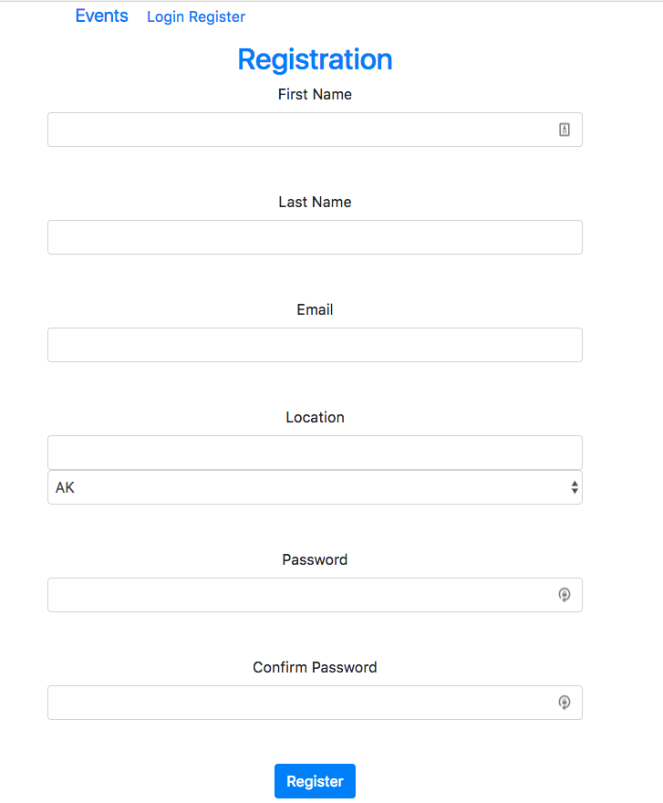
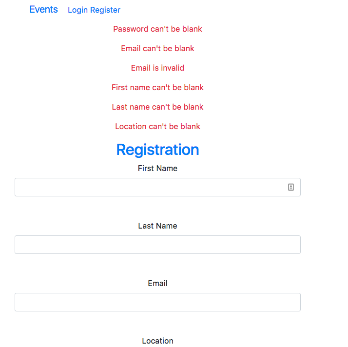
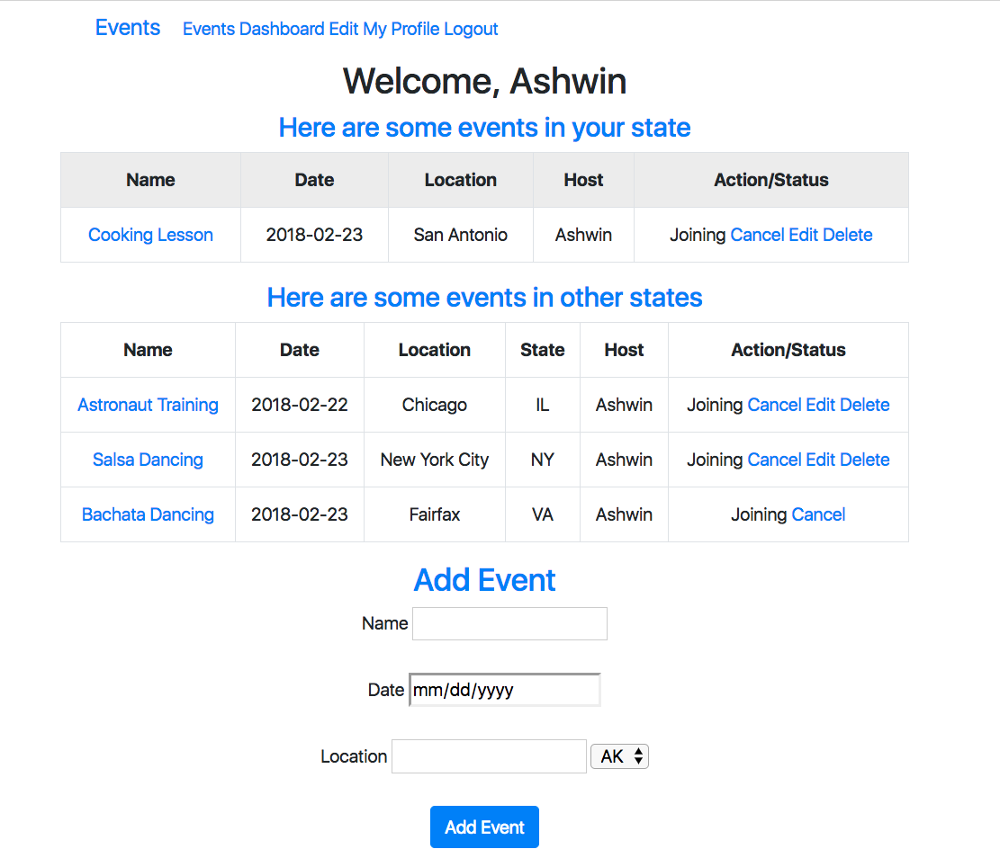
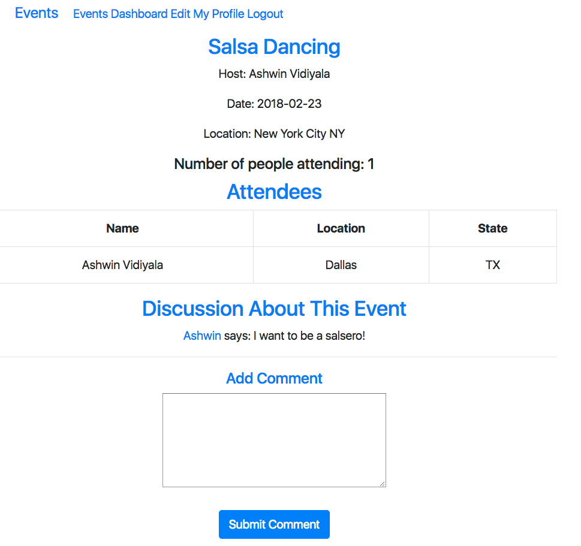
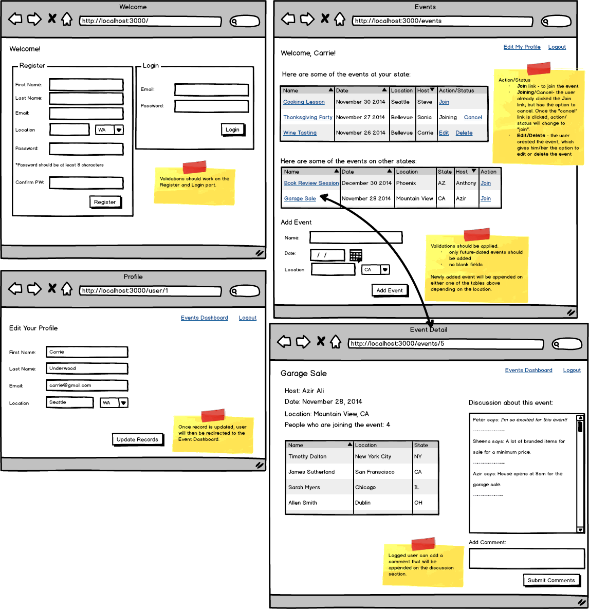

# Events

Rails app where a user can create/edit/delete and join events. The logged user can also put comments on the discussion board per event.

## Features

* Registration and Login with validation.
* Post and comment validation.
* Keeps user logged in through sessions.
* Each user can only delete his event.
* Users can comment on events.
* Display of events separated by the state to where the event will be held (the first table displays the events under the same state to where the logged user is location; the second displays the events to be held on other states).
* Update of the Action/Status portion of each event entry.
* Ability to join an event; cancel the participation to the event or edit/delete event created by the user.
* Display of attendees per event and discussion board per event.
* Logout feature.

## Screenshots

### Registration Page

### Registration Page with Validation Errors

### User Page

### Event Page

## Wireframe

